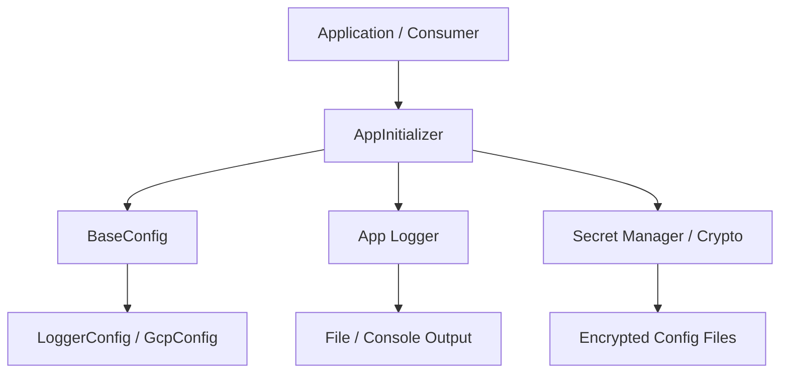
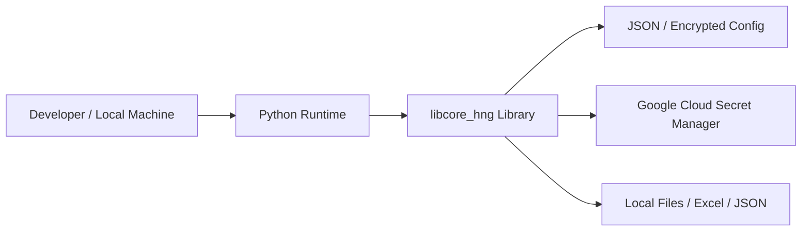

# Architecture Guide for AI Agents

この設計書は、GitHub Copilot や AI Agent がこのリポジトリを理解し、変更を加える際の参照先です。基本方針は、コードの責務と依存関係を明確にし、編集時にどこを触ればよいかを直感的に判断できるようにすることです。

## 1. システム概要

### 1.1 目的

このリポジトリは、Python アプリケーションで共通して必要になる設定管理・ロギング・例外処理・暗号化・ファイル操作をまとめたコアライブラリです。AI API や外部サービスへ接続するアプリケーションの土台として使うことを前提に設計されています。

### 1.2 主要機能

- アプリケーション初期化
- 設定ファイルの読み込みと統合
- 共通ログの設定と出力
- 独自例外の統一管理
- 設定ファイルの暗号化・復号化
- GCP Secret Manager との連携
- Excel / JSON の入出力支援
- ファイル名リネーム支援

### 1.3 利用者

- Python アプリケーション開発者
- 外部サービス連携を行う実装者
- Copilot や AI Agent によるコード生成・改修支援

### 1.4 システムの責務

- 共通設定の提供
- 共通ロガーの提供
- 例外処理の標準化
- 機密設定の安全な管理
- ローカルファイルやデータの操作支援

この責務は [src/libcore_hng/core](src/libcore_hng/core)、[src/libcore_hng/utils](src/libcore_hng/utils)、[src/libcore_hng/exceptions](src/libcore_hng/exceptions) に集約されています。

---

## 2. 技術スタック

### 2.1 実行基盤

- 言語: Python
- 実行形態: ローカル実行を前提とした Python ライブラリ
- Web フレームワーク: 未採用
- データベース: 未採用
- キャッシュ: 未採用
- メッセージキュー: 未採用
- Web サーバー: 未採用
- コンテナ技術: 未採用
- 外部サービス: Google Cloud Secret Manager、Workload Identity Federation

### 2.2 主要依存関係

[pyproject.toml](pyproject.toml) では、次の依存関係が定義されています。

- pydantic
- psutil
- pandas
- openpyxl
- cryptography
- google-cloud-secret-manager
- Pillow
- PyJWT

---

## 3. ディレクトリ構成

### 3.1 主要ディレクトリ

- [src/libcore_hng](src/libcore_hng): 実装本体
  - [src/libcore_hng/core](src/libcore_hng/core): 共通基盤クラス
  - [src/libcore_hng/utils](src/libcore_hng/utils): ユーティリティ群
  - [src/libcore_hng/exceptions](src/libcore_hng/exceptions): 独自例外群
  - [src/libcore_hng/configs](src/libcore_hng/configs): 設定モデル群
  - [src/libcore_hng/cli](src/libcore_hng/cli): CLI ツール群
- [configs](configs): 設定ファイルの配置先
- [tests](tests): テストコードとテストデータ
- [docs](docs): 設計書・ルール文書

### 3.2 変更時の判断基準

- 共通基盤の変更は [src/libcore_hng/core](src/libcore_hng/core) を優先して確認する
- 具体的な処理追加は [src/libcore_hng/utils](src/libcore_hng/utils) に寄せる
- 例外仕様の追加は [src/libcore_hng/exceptions](src/libcore_hng/exceptions) で扱う
- 設定項目の追加は [src/libcore_hng/configs](src/libcore_hng/configs) と [configs](configs) を合わせて確認する

---

## 4. アプリケーション構成

### 4.1 主要な実行フロー

### 4.2 各レイヤの責務

- Application / Consumer
  - このライブラリを利用する側の実装
- AppInitializer
  - アプリケーション起動時の設定読み込みと初期化を担当する
- BaseConfig
  - 設定ファイルを読み込み、構造化された設定オブジェクトへ変換する
- LoggerConfig / GcpConfig
  - ログ設定と GCP 設定のためのモデルを提供する
- App Logger / Crypto / Secret Manager
  - ログ出力、暗号化、シークレット取得を担当する

この構成の中心は [src/libcore_hng/utils/app_core.py](src/libcore_hng/utils/app_core.py) と [src/libcore_hng/core/base_config.py](src/libcore_hng/core/base_config.py) です。

---

## 5. API構成

### 5.1 主要な公開入口

このリポジトリは HTTP API サーバーではなく、Python ライブラリとして設計されています。そのため、通常の REST エンドポイントは存在しません。

### 5.2 CLI 入口

- decrypt-to-encrypt
  - 実装: [src/libcore_hng/cli/decrypt_to_encrypt.py](src/libcore_hng/cli/decrypt_to_encrypt.py)
  - 役割: 暗号化済み設定ファイルを復号し、編集後に再暗号化する

AI Agent が新しい入口を追加する場合は、CLI 追加かライブラリ API 追加かを最初に判断するべきです。

---

## 6. データベース構成

### 6.1 現状のデータ保持方式

このリポジトリには専用データベースは含まれておらず、設定・テストデータ・暗号化ファイルをローカルファイルとして扱います。

### 6.2 保持対象

- 設定ファイル: [configs](configs)
- 暗号化ファイル: [tests/enc_file](tests/enc_file)
- テストデータ: [tests/data](tests/data)

この構成は、永続化層としてデータベースではなくファイルベースを採用していることを示しています。

---

## 7. 認証・認可

### 7.1 認証方式

このリポジトリには一般ユーザー向けの認証システムは実装されていません。

### 7.2 GCP ベースのアクセス制御

- Google Secret Manager へアクセスするために GCP 認証が必要です
- Workload Identity Federation を利用した認証フローを実装しています
- 認証情報は環境変数または設定ファイル経由で注入されます

### 7.3 JWT 利用

JWT は GCP WIF のトークン交換処理で使用されていますが、アプリケーション利用者向けの認証トークンではありません。

### 7.4 ロール管理

ロール管理の実装は含まれていません。

---

## 8. インフラ構成

### 8.1 現状の前提

このリポジトリはローカル Python 実行環境を前提にしており、Docker や Compose、Nginx、Redis、MySQL、PostgreSQL などの運用構成は含まれていません。

### 8.2 構成図

---

## 9. 環境変数

### 9.1 主要環境変数

| 変数名 | 用途 | 利用箇所 |
| --- | --- | --- |
| CONFIG_DIR_NAME | 設定ディレクトリ名の上書き | [src/libcore_hng/core/base_config.py](src/libcore_hng/core/base_config.py) |
| PROJECT_ROOT | プロジェクトルートの指定 | [src/libcore_hng/core/base_config.py](src/libcore_hng/core/base_config.py) |
| CONFIG_DIR | 設定ディレクトリの指定 | [src/libcore_hng/core/base_config.py](src/libcore_hng/core/base_config.py) |
| WIF_PRIVATE_KEY_PATH | WIF 用秘密鍵パス | [src/libcore_hng/utils/secret_manager.py](src/libcore_hng/utils/secret_manager.py) |
| GCP_PROJECT_ID | GCP プロジェクト ID | [src/libcore_hng/utils/secret_manager.py](src/libcore_hng/utils/secret_manager.py) |
| GCP_SECRET_NAME | GCP Secret Manager のシークレット名 | [src/libcore_hng/utils/secret_manager.py](src/libcore_hng/utils/secret_manager.py) |
| APP_ENV | Secret Manager の環境サフィックス | [src/libcore_hng/utils/secret_manager.py](src/libcore_hng/utils/secret_manager.py) |
| APP_SECRET_KEY | 復号鍵の直接指定 | [src/libcore_hng/utils/secret_manager.py](src/libcore_hng/utils/secret_manager.py) |

---

## 10. 外部連携

### 10.1 主要な外部連携

- Google Cloud Secret Manager
- Google Workload Identity Federation / STS / IAM Credentials API

このライブラリは、メール送信やストレージサービスとの接続を標準機能として持っていません。

---

## 11. 非同期処理

### 11.1 現状の方針

このリポジトリには明示的な非同期処理基盤は含まれておらず、処理は基本的に同期的な Python 呼び出しで構成されています。

---

## 12. AI Agent 向けの実装指針

AI Agent がこのリポジトリを編集する際は、次の順序で理解すると効率的です。

1. まず [src/libcore_hng/utils/app_core.py](src/libcore_hng/utils/app_core.py) で初期化フローを把握する
2. 次に [src/libcore_hng/core/base_config.py](src/libcore_hng/core/base_config.py) で設定ロードの流れを確認する
3. 追加する機能がロギング・暗号化・ファイル処理に関わる場合は [src/libcore_hng/utils](src/libcore_hng/utils) を優先する
4. 例外仕様を追加する場合は [src/libcore_hng/exceptions](src/libcore_hng/exceptions) に合わせる
5. 設定項目を増やす場合は [src/libcore_hng/configs](src/libcore_hng/configs) と [configs](configs) の両方を更新する
