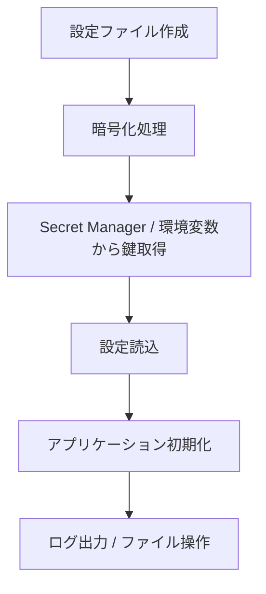
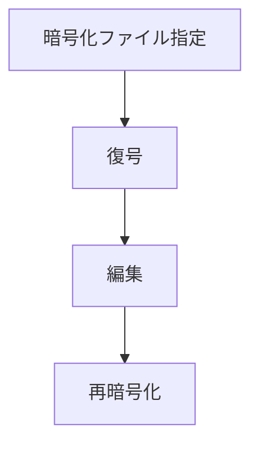
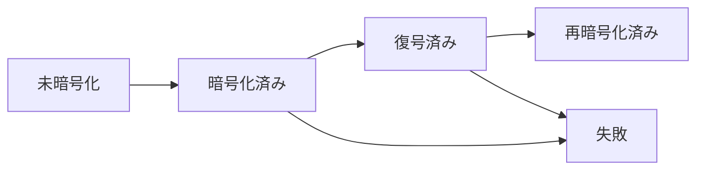

# Business Rules

この文書は、コード上で確認できる業務上の判断基準と、運用・ポリシーとして追記された内容を統合したものです。技術実装の説明ではなく、業務ルールとして扱うべき前提・制約・運用方針を中心に整理します。

## 1. システムの業務目的

### 1.1 このライブラリが担う役割

このライブラリは、複数の Python パッケージやサービスで共通して利用する設定管理・認証・シークレット管理・ユーティリティ機能をまとめた共通基盤です。各サービスで個別に実装していた以下の機能を標準化することを目的としています。

- 設定管理
- GCP 認証
- Secret Manager 連携

### 1.2 利用者

- Python アプリケーション開発者
- 設定ファイルを管理する運用担当者
- GCP や Secret Manager を扱うインフラ・セキュリティ担当者

### 1.3 主なユースケース

- アプリケーション設定ファイルの読み込み
- 機密設定の暗号化・復号化
- Secret Manager からのシークレット取得
- ログ出力とデバッグ支援
- ファイル操作の標準化

---

## 2. 業務方針・運用ポリシー

### 2.1 設計方針

- 共通ライブラリとして利用する
- 複数のパッケージやサービスで再利用する
- GCP 連携を標準化する
- 設定管理方法を統一する

### 2.2 Secret Manager 利用方針

- 暗号化・復号化に利用する秘密鍵のみを Google Secret Manager で管理する
- 開発環境用と本番環境用の秘密鍵を分離して管理する
- アプリケーション設定そのものは Secret Manager では管理しない
- 設定ファイル内の機密情報を保護するために秘密鍵を利用する
- 秘密鍵をソースコードへ埋め込まない
- 秘密鍵を Git リポジトリへコミットしない

### 2.3 セキュリティポリシー

- Secret Manager を利用する
- API キーや秘密情報を Git 管理しない
- 秘密情報は暗号化して保存する
- 平文シークレットのコミットを許可しない

### 2.4 利用システム

このライブラリは、以下のシステムでの利用を前提にしています。

- personyx
- pycorex

### 2.5 禁止事項

- 平文シークレットのコミット
- 共通ライブラリを経由しない Secret 取得
- 独自ロガーの作成
- ライブラリ利用側に業務ロジックを追加すること

### 2.6 AI 向けガイドライン

AI に対しては、以下の実装を提案しないことを基本方針とします。

- API キーのハードコード
- シークレットの平文保存
- 設定機構を無視した実装
- Secret Manager を経由しない認証情報取得
- 共通ロガーを使わないログ出力
- ライブラリ内への業務ロジック追加

---

## 3. 主要な業務機能

| 機能名 | 説明 | 関連するAPI | 関連するテーブル | 関連するService |
| --- | --- | --- | --- | --- |
| 設定管理 | アプリケーション設定を読み込んで共通構成として利用する | なし | なし | BaseConfig, AppInitializer |
| ログ管理 | 実行ログを統一形式で出力する | なし | なし | app_logger |
| 暗号化・復号化 | 設定ファイルを暗号化・復号化する | Fernet | なし | crypto |
| シークレット取得 | GCP Secret Manager から鍵や秘密情報を取得する | Google Secret Manager API | なし | secret_manager |
| ファイル操作支援 | Excel/JSON ファイルの取り込み、出力、リネームを支援する | なし | なし | io_manager, file_renamer |

---

## 4. ユーザー種別・役割

### 4.1 役割の整理

- 開発者: 実装・テスト・設定変更
- 運用担当者: 設定ファイルの更新・暗号化処理の実行
- セキュリティ/インフラ担当者: シークレット管理とアクセス制御の運用

### 4.2 現状の制約

コード上では、一般ユーザー向けの役割管理や権限管理の実装は確認できません。したがって、権限の差分は運用ルールとして扱う前提です。

---

## 5. 認証・権限制御ルール

### 5.1 確認できる内容

- ユーザー認証そのものは実装されていません
- GCP へのアクセスには認証情報が必要です
- シークレット取得には環境変数または GCP 設定が必要です

### 5.2 実運用上の前提

- 設定ファイルの復号には、正しい秘密鍵または Secret Manager からの取得権限が必要です
- WIF を用いる場合、対象の GCP プロジェクト・プール・サービスアカウント設定が必要です

---

## 6. データ管理ルール

### 6.1 管理対象

- 設定データは JSON ファイルとして管理する
- 機密情報は暗号化ファイルとして扱う
- 復号鍵は環境変数または Secret Manager から取得する
- ログはファイル出力を前提として扱う

### 6.2 保持方針

- 設定ファイルは [configs](configs) 配下に配置する
- 暗号化ファイルは拡張子 .enc を付与する
- 復号後の一時ファイルは一時ディレクトリで扱う
- 設定変更時は暗号化ファイルを再生成する
- 本番環境と開発環境でシークレットを分離する

---

## 7. 業務フロー

### 7.1 設定ライフサイクル

### 7.2 CLI での編集フロー

---

## 8. 状態遷移ルール

### 8.1 主要な状態

- 未暗号化
- 暗号化済み
- 復号済み
- 再暗号化済み
- 失敗

### 8.2 状態遷移図

---

## 9. 入力チェック・運用ルール

### 9.1 入力チェック

- 設定ファイルの存在有無を確認する
- 暗号化対象ファイルが存在しない場合は処理を中止する
- 既存ファイル名との衝突時は、衝突方針を適用する
- ファイルの拡張子や出力先に応じて処理を分岐する

### 9.2 実装上の判断条件

- [src/libcore_hng/utils/file_renamer.py](src/libcore_hng/utils/file_renamer.py)
  - `on_conflict` が `error` / `skip` / `overwrite` のいずれかでない場合は例外
- [src/libcore_hng/cli/decrypt_to_encrypt.py](src/libcore_hng/cli/decrypt_to_encrypt.py)
  - 入力ファイルが存在しない場合は処理終了

---

## 10. 通知・外部連携ルール

### 10.1 通知

このリポジトリには、ユーザー向けメール通知やプッシュ通知の実装はありません。代わりに、ログ出力・コンソール出力・例外メッセージを利用して状態を伝えます。

### 10.2 外部連携

- Google Cloud Secret Manager
- Google Workload Identity Federation
- STS / IAM Credentials API

連携は主に設定ファイルの復号・シークレット取得・初期化時に行われます。

---

## 11. 業務上の制約

- 設定ファイルが存在しない場合は初期化できない
- 暗号化鍵が取得できない場合は処理を継続できない
- ファイル名衝突時は、既定方針に従って扱う
- 既定の設定ディレクトリが見つからない場合は例外となる
- 平文シークレットをリポジトリに残してはならない
- 共通ライブラリを経由しない Secret 取得は行わない

---
